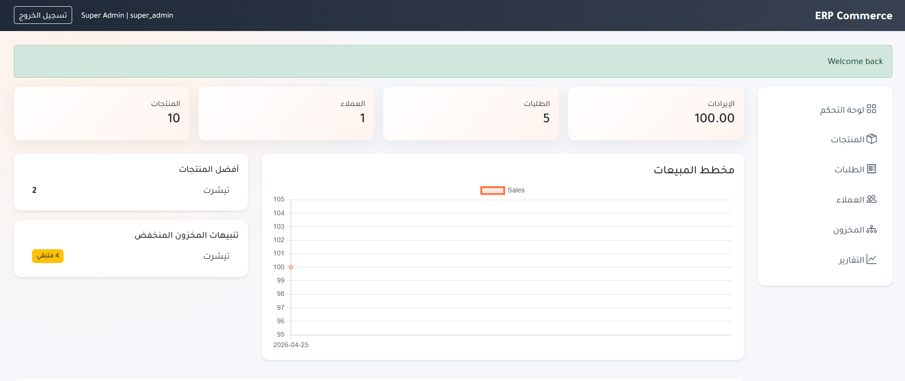
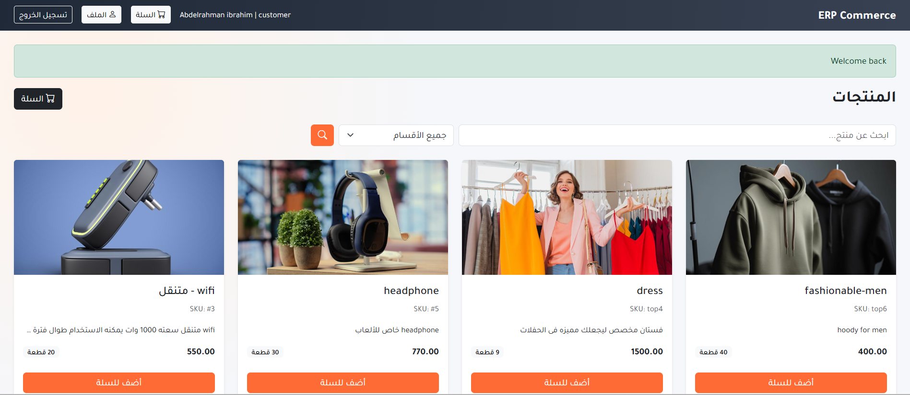

# ERP Commerce Platform (Flask)

A modular ERP + E-commerce system inspired by WooCommerce workflows.

## Stack
- Python + Flask (App Factory)
- SQLAlchemy ORM (SQLite default, PostgreSQL-ready via DATABASE_URL)
- Flask-Login (role-based authentication)
- Bootstrap 5 RTL UI + Chart.js
- ReportLab PDF invoice generation

## Core ERP Modules
- Authentication and role-based access (super_admin, admin, staff, customer)
- Product and inventory management (SKU, category, tags, variants)
- Sales and cart system (checkout and order creation)
- Order management (status workflow)
- CRM module (customer list, top customers, tags)
- Invoice module (auto PDF invoice per order)
- Dashboard analytics (cards, chart, best sellers, alerts)
- Notification structure (in-app notification records)

## Project Structure

```text
app.py
erp_app/
  __init__.py
  config.py
  extensions.py
  models.py
  security.py
  blueprints/
    auth/routes.py
    admin/routes.py
    products/routes.py
    orders/routes.py
    crm/routes.py
    inventory/routes.py
  services/
    product_service.py
    inventory_service.py
    order_service.py
    crm_service.py
    report_service.py
    dashboard_service.py
    invoice_service.py
    notification_service.py
  templates/
    layouts/
    auth/
    admin/
    products/
    orders/
    crm/
    inventory/
  static/
    css/app.css
    invoices/
```

## Run Locally

```bash
python -m pip install -r requirements.txt
python app.py
```

Open: http://127.0.0.1:5006

## Default Super Admin
- Email: `superadmin@erp.local`
- Password: `admin123`

## Test Accounts
Use these credentials to log in during development/testing:

- `superadmin@erp.local` — role: `super_admin` — password: `admin123`
- `admin@erp.local` — role: `admin` — password: `admin123`
- `staff@erp.local` — role: `staff` — password: `staff123`

## Roles and Access
- `super_admin`: full control
- `admin`: products, orders, CRM, inventory, reports
- `staff`: order processing and inventory updates
- `customer`: catalog, cart, checkout, my orders

## Screenshots

### Admin Dashboard


### User Interface


## Notes
- DB defaults to SQLite file `erp.sqlite3` (inside Flask instance path).
- To use PostgreSQL, set `DATABASE_URL` environment variable.
- Invoices are generated at `erp_app/static/invoices/`.

## Installation

1. Create and activate a virtual environment (Windows example):

```powershell
python -m venv .venv
.venv\Scripts\Activate.ps1
python -m pip install -r requirements.txt
```

2. Copy or create an `.env` file in the project root to set environment variables (see next section).

## Environment Variables

- `FLASK_ENV` (optional): `development` or `production`.
- `DATABASE_URL` (optional): SQLAlchemy URL for PostgreSQL or other RDBMS. If unset, the app uses the local SQLite file.
- `SECRET_KEY`: Flask session secret (set for production).
- `MAIL_USERNAME`, `MAIL_PASSWORD`, `MAIL_SERVER`, `MAIL_PORT` (optional): email settings for notifications.

Place these in an `.env` file or export them in your environment before running the app.

## Database

- By default the app uses SQLite at the Flask `instance/` path (see `instance/erp.sqlite3`).
- To initialize or migrate the database (Flask-Migrate / Alembic):

```powershell
flask db init   # only if migrations folder does not exist
flask db migrate -m "Initial"
flask db upgrade
```

Run the above commands from the project root with the virtualenv activated.

## Create Initial Users

If the project includes a script or CLI for creating users, use it to add the test accounts. Otherwise you can seed the database directly via a small script or the Flask shell. Example (Flask shell):

```powershell
set FLASK_APP=app.py
flask shell
# then run Python code to create users and commit
```

## Run Locally

Start the development server (default port 5006):

```powershell
python app.py
```

Open http://127.0.0.1:5006 in your browser.

## Test Accounts
Use these credentials to log in during development/testing:

- `superadmin@erp.local` — role: `super_admin` — password: `admin123`
- `admin@erp.local` — role: `admin` — password: `admin123`
- `staff@erp.local` — role: `staff` — password: `staff123`

## Testing

- There are no automated tests included by default. Add unit tests under a `tests/` folder and run with `pytest`.

## Troubleshooting

- If the server fails to start, check `.env` and `FLASK_APP` settings.
- If database migrations fail, ensure the virtualenv has the same SQLAlchemy/Alembic versions listed in `requirements.txt`.

## Contributing

- Fork the repo, create a feature branch, and open a pull request. Keep changes focused and include tests where possible.

## License

This project does not include a license file. Add a `LICENSE` if you plan to share the code publicly.
